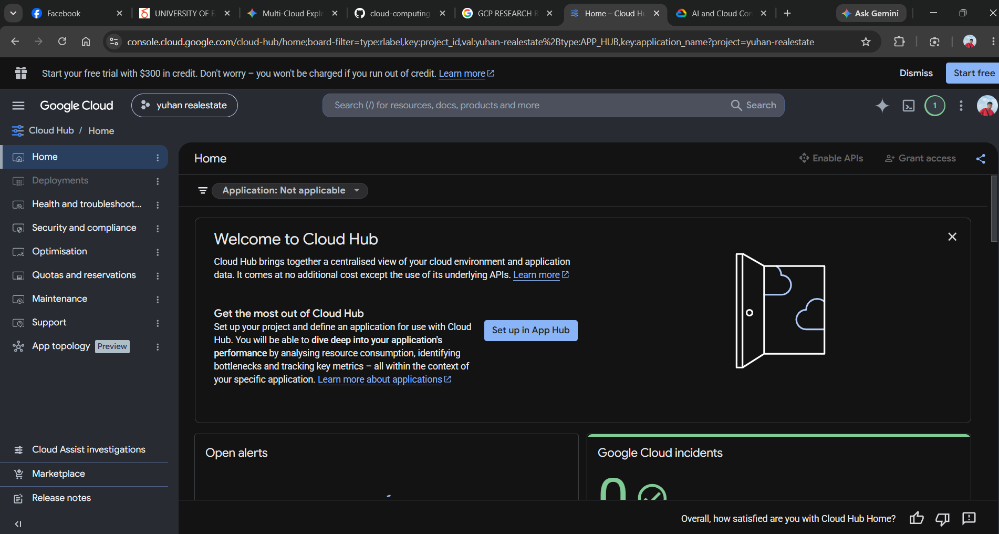

# Google Cloud Platform (GCP) Research Report

## Brief Overview
Google Cloud Platform (GCP) is a suite of cloud computing services offered by Google, launched in 2008. GCP leverages the same infrastructure that Google uses internally for products like Search and YouTube, specializing heavily in big data analytics, machine learning, and container management.

## Global Infrastructure
- **Regions:** 43 Geographic Regions
- **Availability Zones:** 130 Zones
- **Edge Locations:** 200+ edge network locations for global load balancing and Cloud CDN

## Cloud Management Console
The Google Cloud Console is designed around project-based organization and simplicity. It features an intuitive web dashboard, built-in Cloud Shell with pre-configured developer tools, and clear resource monitoring via Google Cloud Observability.

## Core Services
1. **Compute:** Google Compute Engine -Run VMs on high-performance and reliable cloud infrastructure. Choose from preset or custom machine types for web servers, databases, and applications that fuel your agents.
2. **Storage:** Google Cloud Storage - Unified object storage with high availability and global edge caching.
3. **Database:** Cloud SQL - Fully managed relational database for MySQL, PostgreSQL, and SQL Server.
4. **Networking:** Cloud VPC - Global virtual private network spanning multiple regions seamlessly.

## Advantages
1. Industry-leading AI and Machine Learning infrastructure (e.g., Vertex AI and Cloud TPUs).
2. Pioneer of Kubernetes, offering native optimization through Google Kubernetes Engine (GKE).
3. High-speed, private global fiber-optic backbone connecting all data centers.

## Typical Enterprise Use Cases
- Big data processing, real-time analytics, and machine learning model training.
- Containerized application development managed with native Kubernetes clusters.

CITETATION

https://cloud.google.com/products/compute

